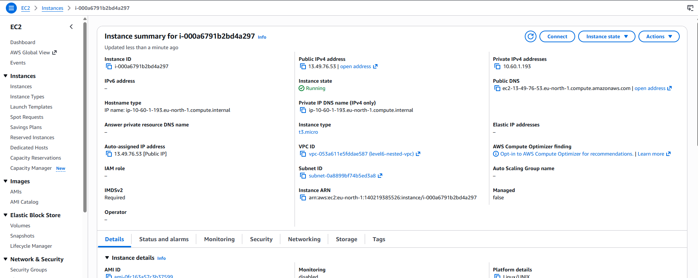

# Level 5 – Deploying an EC2 Web Server with CloudFormation

## Overview

In this project, I used AWS CloudFormation to deploy a fully functional EC2 web server. Instead of manually launching an instance and configuring it through the AWS Management Console, the entire infrastructure—including the EC2 instance, Security Group, and web server installation—was defined declaratively in a CloudFormation template.

The template automatically provisions an Amazon Linux 2023 EC2 instance, installs Apache HTTP Server using UserData, configures the service to start at boot, and publishes the website's public URL as a CloudFormation output.
---
## Deployment Result

The CloudFormation template successfully provisioned all required resources. The stack reached the **CREATE_COMPLETE** state, confirming that the EC2 instance, Security Group, and associated resources were deployed successfully.

### CloudFormation Stack


### Stack Outputs

The Outputs section displays the automatically generated public IP address and website URL.


---

## Objectives

* Provision an EC2 instance using CloudFormation.
* Create a Security Group allowing HTTP and SSH access.
* Install and configure Apache automatically with UserData.
* Dynamically retrieve the latest Amazon Linux AMI using AWS Systems Manager Parameter Store.
* Output the instance's Public IP and Website URL.

---

## Technologies Used

* AWS CloudFormation
* Amazon EC2
* Amazon Linux 2023
* Security Groups
* UserData
* AWS Systems Manager Parameter Store

---

## Architecture

```text
                    AWS CloudFormation
                           │
                           ▼
                Creates Security Group
                           │
                           ▼
                 Launches EC2 Instance
                           │
                           ▼
              Executes UserData Script
                           │
                           ▼
            Installs Apache HTTP Server
                           │
                           ▼
             Hosts Static HTML Web Page
                           │
                           ▼
             Accessible via Public IP
```

---

## What I Learned

This project introduced several important CloudFormation concepts:

* Using Parameter Store to automatically retrieve the latest AMI.
* Bootstrapping EC2 instances using UserData.
* Using intrinsic functions such as Ref, GetAtt, Base64, and Sub.
* Publishing useful deployment information through Outputs.
* Managing infrastructure updates with CloudFormation.

---

## Observation

After updating the InstanceType from **t3.micro** to **t3.small**, CloudFormation replaced the EC2 instance because changing the instance type required resource replacement. As a result, the Public IP address also changed.

This demonstrates how CloudFormation determines whether a property can be updated in place or whether the resource must be recreated.

---
## Web Server Verification

After waiting a few minutes for the UserData script to complete, Apache HTTP Server was installed automatically and the web page became accessible through the public IP address.


---
## EC2 Instance

The deployed EC2 instance is visible in the EC2 console with the instance type specified in the CloudFormation template.



---

## Challenge Completed

As an extension, an Elastic IP can be associated with the EC2 instance using:

* AWS::EC2::EIP
* AWS::EC2::EIPAssociation

With an Elastic IP attached, future instance replacements preserve the public IP address, making the web server endpoint stable.

---

## Key Takeaways

* Infrastructure can be fully automated using CloudFormation.
* UserData enables automated software installation.
* Security Groups act as virtual firewalls.
* Outputs simplify retrieving deployment information.
* Elastic IPs provide stable public addresses across instance replacements.
