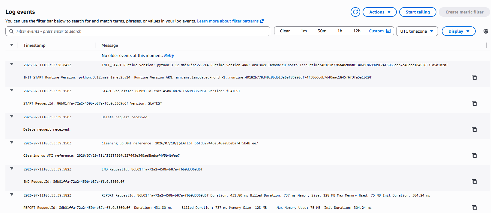

# Building a Lambda-Backed CloudFormation Custom Resource (Level 7)

## Handling Create, Update, and Delete Events Correctly

One of the most powerful features of AWS CloudFormation is the ability to extend its functionality using **Lambda-backed Custom Resources**. While CloudFormation provides many native resource types, there are situations where infrastructure needs to perform logic that isn't available through built-in resources.

In this project, I implemented a Lambda-backed Custom Resource that dynamically discovers the latest Amazon Linux 2023 AMI using the EC2 `DescribeImages` API. I then enhanced the solution to correctly handle the **Delete** lifecycle event, demonstrating how every CloudFormation Custom Resource should explicitly respond to Create, Update, and Delete requests.

---

## Project Objectives

* Deploy a Lambda-backed Custom Resource using CloudFormation.
* Dynamically retrieve the latest Amazon Linux 2023 AMI.
* Return the discovered AMI ID to CloudFormation.
* Properly handle Create, Update, and Delete lifecycle events.
* Log cleanup information during stack deletion.
* Verify lifecycle execution using CloudWatch Logs.

---

## Technologies Used

* AWS CloudFormation
* AWS Lambda
* Amazon EC2
* AWS IAM
* Amazon CloudWatch Logs
* AWS Systems Manager (concept comparison)

---

## Architecture

```
CloudFormation Stack
        │
        ▼
Custom Resource
        │
        ▼
Lambda Function
        │
        ▼
EC2 DescribeImages API
        │
        ▼
Latest AMI Returned
        │
        ▼
CloudFormation Output
```

---

## The Problem

Initially, the Lambda function only processed **Create** and **Update** requests.

```python
if event["RequestType"] in ("Create", "Update"):
```

For Delete events it simply returned success without performing any meaningful action.

Although nothing actually needs to be deleted in this scenario, CloudFormation still invokes the Lambda whenever the stack is deleted.

Ignoring Delete events is considered poor practice because many real-world Custom Resources create external resources that must be cleaned up.

---

## Enhancement

The Lambda was modified to explicitly handle the Delete request.

Instead of silently succeeding, it now:

* Reads the AMI ID stored in the Custom Resource properties.
* Logs which AMI is being cleaned up.
* Returns SUCCESS back to CloudFormation.

Example implementation:

```python
 elif event["RequestType"] in ("Delete"):
        ami_id = ami_id = event["PhysicalResourceId"]
        print("Delete request received.")
        print("Cleaning up AMI reference: "+ ami_id)
        send_response(event, context, "SUCCESS", {})
else:
        send_response(event, context, "SUCCESS", {})

```

This doesn't delete the AMI because the Lambda did not create it. Instead, it demonstrates proper lifecycle management and produces an audit trail in CloudWatch Logs.



---

## CloudWatch Verification

After deleting the CloudFormation stack:

1. Open **CloudWatch**.
2. Navigate to **Log Groups**.
3. Open the log group created for the Lambda function.
4. Locate the log stream generated during stack deletion.

The log should contain entries similar to:

```
Delete request received.
Cleaning up AMI reference: ami-0123456789abcdef0
```

This confirms that CloudFormation invoked the Delete lifecycle event successfully.

---

## What I Learned

This exercise reinforced several important CloudFormation concepts:

### Every lifecycle event matters

CloudFormation invokes Custom Resources during:

* Create
* Update
* Delete

A Lambda-backed Custom Resource should always implement logic for each event.

---

### CloudFormation waits for a response

The Lambda must send a response to the CloudFormation `ResponseURL`.

If it fails to do so:

* the stack hangs,
* eventually times out,
* and rolls back.

---

### Delete does not always mean delete resources

Sometimes a Delete request simply means:

* log information,
* remove metadata,
* revoke permissions,
* clean temporary files,
* or notify another service.

Not every Delete handler destroys infrastructure.

---

### CloudWatch is essential

CloudWatch Logs make it easy to verify:

* which lifecycle event executed,
* what data CloudFormation passed,
* whether the Lambda succeeded,
* and what values were returned.

---

## Challenges Encountered

* Understanding the CloudFormation Custom Resource response contract.
* Learning why Delete events must always be handled.
* Distinguishing between resources created by the Lambda and resources merely referenced by it.
* Verifying execution through CloudWatch Logs.

---

## Key Takeaways

* Custom Resources allow CloudFormation to execute custom logic.
* Every Custom Resource should explicitly handle Create, Update, and Delete requests.
* Lambda must always send a SUCCESS or FAILED response back to CloudFormation.
* CloudWatch Logs are invaluable for debugging and validating lifecycle behavior.
* Even when no cleanup is required, implementing meaningful Delete handling results in more reliable and production-ready infrastructure.

---

## Repository Structure

```
level7-custom-resource/
│
├── custom-resource.yaml
├── README.md
├── screenshots/
└── LICENSE
```

---

## Future Improvements

Possible enhancements include:

* Packaging the Lambda separately instead of using inline code.
* Using AWS SAM or the AWS CDK for deployment.
* Returning additional metadata from the Custom Resource.
* Adding automated deployment with GitHub Actions.
* Writing unit tests for the Lambda function.

---

## Conclusion

This project demonstrated how Lambda-backed Custom Resources extend AWS CloudFormation beyond native resource types. By enhancing the Lambda to properly process Delete events and logging the AMI reference during stack deletion, the solution follows CloudFormation best practices and provides clear operational visibility through CloudWatch Logs.

Handling every lifecycle event correctly is a small change that significantly improves the reliability, maintainability, and production readiness of infrastructure as code.
